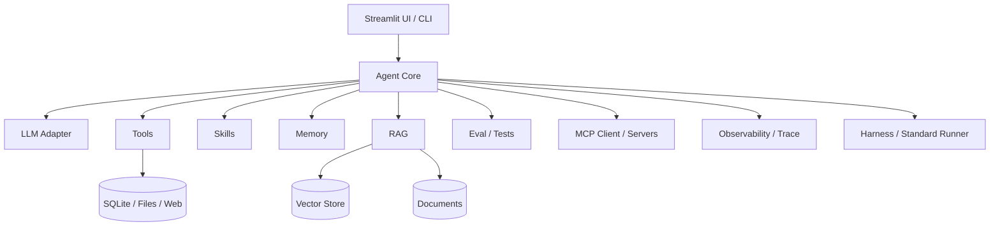

# 标准 Agent 项目架构说明

这个项目的目标是用一个完整但轻量的代码库展示标准 Agent 项目通常包含哪些模块，以及各模块之间如何协作。

## 1. 总体分层

## 2. Agent Core

位置：`src/agent/core.py`

职责：

- 维护对话上下文。
- 构建 system prompt。
- 调用 LLM。
- 识别 tool call。
- 执行工具并把 observation 回填给 LLM。
- 限制最大循环次数，避免无限调用。

标准 Agent 一般都会有类似的控制循环：

1. 用户输入。
2. 组装上下文。
3. LLM 思考并决定是否调用工具。
4. Agent 执行工具。
5. LLM 根据工具结果生成最终回答。

## 3. LLM Adapter

位置：`src/llm/`

职责：

- 屏蔽不同模型供应商的 API 差异。
- 把工具 schema 转换成不同 provider 需要的格式。
- 把 provider 原始响应标准化成统一的 `LLMResponse` 和 `ToolCall`。

标准项目不应该把 Anthropic/OpenAI 的 SDK 调用散落在业务代码里，而应该集中在 adapter 层。

## 4. Tools

位置：`src/tools/`

职责：

- 封装原子能力，比如 SQL 查询、文件读取、计算、搜索、图表生成、Python 执行。
- 每个 Tool 提供统一的 name、description、parameters、execute 接口。
- 工具层必须做输入校验和安全边界控制，不只依赖 prompt 约束。

本项目已经包含：

- `sql_query`：只允许 SELECT。
- `read_file` / `list_files`：限制在知识库目录下。
- `python_exec`：子进程沙箱、超时、模块白名单。
- `calculator`：AST 数学表达式求值。
- `csv_import`：路径和表名校验。

## 5. Skills

位置：`src/skills/`、`skills/*/SKILL.md`

职责：

- 表达比工具更高层的能力，例如数据分析、报告生成、文档问答。
- 包含专用 system prompt、关键词/语义路由信息、推荐工具集。
- 用 `SKILL.md` 文件沉淀每个 Skill 的适用场景、工作流、工具规范和示例问题。

Tool 是“能做什么”，Skill 是“如何组织一组工具完成某类任务”。

本项目把 Skill 分成两层：

- `src/skills/`：运行时代码层，Agent 用它做路由和 prompt 注入。
- `skills/`：文件系统说明层，面向学习、复用和后续标准 Agent Skills 演进。

## 6. RAG

位置：`src/rag/`

职责：

- 文档加载。
- 文本切片。
- Embedding。
- 向量存储。
- 向量检索 + BM25 混合检索。
- 重排序。
- 作为工具暴露给 Agent。

标准 RAG 项目需要关注索引生命周期：文档变更后要能重建或增量更新。本项目使用 manifest 记录文档签名，避免旧索引长期失效。

## 7. Memory

位置：`src/memory/`

职责：

- 短期记忆：当前对话窗口。
- 长期记忆：跨会话持久化信息。
- 情景记忆：历史交互摘要。
- 工作记忆：当前任务执行步骤。

标准 Agent 项目通常不会只保存原始 messages，还会把长期偏好、历史发现和任务状态分开管理。

## 8. MCP

位置：`src/mcp/`、`mcp_servers/`

职责：

- 用标准协议把外部数据源或能力暴露给 Agent。
- Client 负责连接、发现工具、调用工具。
- Server 负责封装数据库、知识库等资源。

MCP 的价值是让 Agent 可以接入更多外部系统，同时保持工具发现和调用方式一致。

## 9. Observability

位置：`src/observability.py`、`src/agent/core.py`

职责：

- 记录每次 Agent run 的 LLM 调用次数、耗时和 token usage。
- 记录工具调用次数、耗时、成功状态和输出预览。
- 在 API/UI 返回 trace，便于解释 Agent 为什么慢、调用了什么、成本大概是多少。

生产级 Agent 一般需要 trace / latency / token / tool audit，这些信息是调试、优化成本和排查幻觉的重要基础。

## 10. Evaluation & Tests

位置：`src/eval/`、`tests/`

职责：

- 单元测试：验证工具、RAG、Memory、Agent 主循环。
- 基准测试：验证工具选择、关键词、响应质量等。
- CI 质量门禁：一条命令稳定运行默认测试。

本项目默认测试 mock 真实 embedding，避免 CI 依赖模型下载；真实 embedding 测试通过 `make test-embedding` 显式开启。

## 11. Harness

位置：`src/harness/`、`data/harness_cases.yaml`

职责：

- 把 Agent 输入、输出、工具轨迹、skill、trace、耗时统一收集。
- 支持 dry-run 脚本化 LLM，保证不依赖真实模型也能验证 Agent loop。
- 支持 live 模式，用真实 Agent / LLM 跑端到端场景。
- 校验工具调用、关键词、来源和 skill，作为 demo、回归和评估的共同入口。

标准 Agent 项目通常需要这样的 harness：否则只能靠人工试问，无法稳定复现和观察 Agent 行为。

## 12. Production Checklist

一个更接近生产标准的 Agent 项目通常还需要：

- 更严格的权限模型和用户确认机制。
- 工具调用审计日志。
- Prompt 注入防护与上下文来源标注。
- RAG 检索质量评估集。
- LLM 调用重试、超时、成本统计。
- 可观测性：trace、latency、token usage。
- 部署配置：容器、环境变量、密钥管理。
- CI：测试、lint、类型检查、安全扫描。
