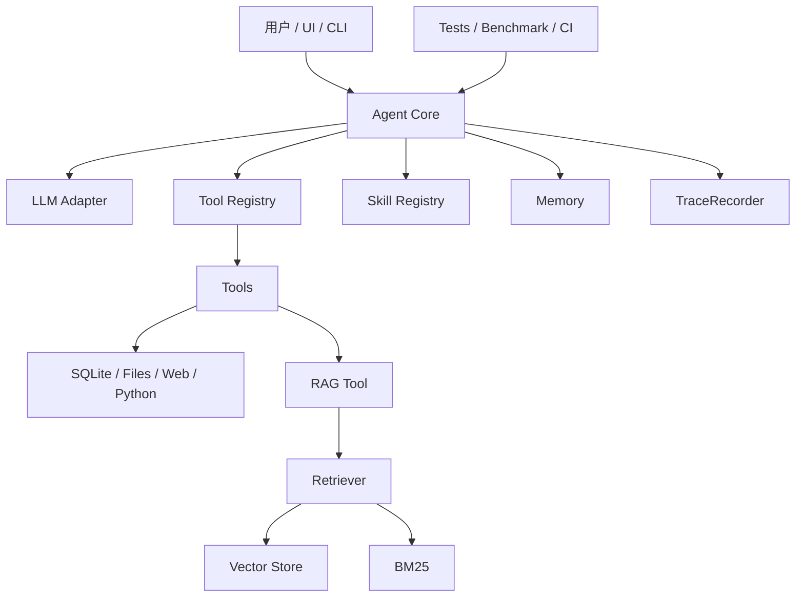

# 开发手册

这份文档面向想深入理解或继续扩展本项目的人，目标是说明一个标准 Agent 项目应该如何组织模块、如何新增能力、如何测试和如何排查问题。

## 1. 项目心智模型

本项目把 Agent 拆成几层：



核心原则：

- `Agent Core` 负责编排，不直接绑定某个模型厂商或某个数据源。
- `LLM Adapter` 负责屏蔽 Anthropic、OpenAI 兼容接口等差异。
- `Tools` 提供原子能力，并负责自己的安全校验。
- `Skills` 表达高层任务策略，告诉 Agent 哪类任务应该优先使用哪些工具。
- `RAG`、`Memory`、`MCP` 是 Agent 获取外部上下文和长期能力的扩展层。
- `Trace`、`Eval`、`Tests` 保证 Agent 可解释、可优化、可持续迭代。

## 2. 目录职责

| 路径 | 职责 |
|---|---|
| `app.py` | Streamlit UI，负责交互展示，不承载核心 Agent 逻辑 |
| `config/settings.yaml` | 默认配置，包括 LLM、RAG、Memory、Agent 行为 |
| `src/config.py` | 配置加载与环境变量覆盖 |
| `src/agent/core.py` | ReAct 主循环、工具调用、Skill 路由、Trace 汇总 |
| `src/llm/` | 不同 LLM provider 的 adapter 和统一响应模型 |
| `src/tools/` | SQL、文件、计算、Python、搜索、图表、CSV、RAG 等工具 |
| `src/skills/` | 高层任务能力与路由描述 |
| `src/rag/` | 文档加载、切片、Embedding、检索、重排和向量存储 |
| `src/memory/` | 短期、长期、情景、工作记忆 |
| `src/mcp/` | MCP Client |
| `mcp_servers/` | SQLite、Knowledge 等 MCP Server 进程 |
| `src/eval/` | Benchmark CLI、指标、评估用例 |
| `src/doctor.py` | 本地环境健康检查 |
| `src/observability.py` | Agent trace 和事件记录 |
| `tests/` | 默认可离线稳定运行的测试集 |
| `scripts/` | 本地入口脚本，供 Makefile 和 CI 复用 |

## 3. 环境准备

```bash
pip install -r requirements.txt
pip install -r requirements-dev.txt
cp .env.example .env
make init-db
make doctor
```

推荐先不填真实 API Key，也能运行大部分单元测试和 dry-run benchmark。需要真实对话或 live benchmark 时，再配置 `.env`。

## 4. 常用命令

| 命令 | 作用 | 是否调用真实模型 |
|---|---|---|
| `make init-db` | 初始化 SQLite 示例数据库 | 否 |
| `make doctor` | 检查环境、依赖、数据库、知识库、密钥 | 否 |
| `make run-app` | 启动 Streamlit UI | 取决于实际对话 |
| `make test` | 编译检查 + 默认 pytest | 否 |
| `make lint` | ruff 静态检查 | 否 |
| `make check` | lint + 默认测试，CI 同款质量门禁 | 否 |
| `make test-embedding` | 真实 Embedding 集成测试 | 是 |
| `make benchmark` | dry-run 评估用例结构并生成报告 | 否 |
| `make benchmark-live` | 使用真实 Agent/LLM 跑评估 | 是 |
| `make harness` | 使用脚本化 LLM 跑标准 harness 任务，验证目标、轨迹和边界 | 否 |
| `make harness-live` | 使用真实 Agent/LLM 跑 harness 场景 | 是 |
| `make rag-eval` | 离线评估 RAG 检索质量并生成报告 | 否 |

## 5. 新增 Tool

Tool 是 Agent 能调用的原子动作。标准流程：

1. 在 `src/tools/` 新增文件。
2. 继承统一 Tool 基类。
3. 定义工具名、描述和 JSON Schema 参数。
4. 在 `execute` 中完成输入校验、安全控制和错误处理。
5. 注册到工具集合。
6. 添加测试。
7. 更新文档。

最小结构示例：

```python
from src.tools.base import Tool, ToolPolicy


class ExampleTool(Tool):
    name = "example_tool"
    description = "说明这个工具适合解决什么问题"
    policy = ToolPolicy(
        risk_level="low",
        read_only=True,
        idempotent=True,
        allowed_scopes=("memory",),
        description="只做内存里的字符串转换。",
    )
    parameters = {
        "type": "object",
        "properties": {
            "text": {"type": "string", "description": "输入文本"},
        },
        "required": ["text"],
    }

    def execute(self, text: str) -> str:
        if not text.strip():
            return "错误：text 不能为空"
        return text.upper()
```

Tool 设计检查点：

- 名称是否稳定、短小、语义明确。
- description 是否告诉模型什么时候该用它。
- parameters 是否足够严格，避免模糊输入。
- policy 是否声明风险等级、是否只读、是否需要用户确认。
- execute 是否能安全失败。
- 是否有路径、SQL、网络、代码执行等风险。
- 是否能被 fake LLM 测试覆盖。

风险分级建议：

| 风险 | 适用工具 | 要求 |
|---|---|---|
| low | 纯计算、本地只读统计 | schema + 基本输入校验 |
| medium | 文件读取、SQL SELECT、外网搜索、写 artifact | 路径/SQL/网络边界 + trace 审计 |
| high | 代码执行、写数据库、删除/覆盖数据、调用外部系统改状态 | `requires_confirmation=True` + 明确 `allowed_scopes` |

`ToolPolicy` 和 prompt 约束不是一回事。prompt 可以提醒模型少犯错，但真正的安全边界必须在工具代码和 Agent runtime 中执行。

## 6. 新增 Skill

Skill 是比 Tool 更高层的任务策略，例如“数据分析”“文档问答”“报告生成”。标准流程：

1. 在 `src/skills/` 新增 Skill 类。
2. 写清楚 Skill 的适用场景和专用提示词。
3. 配置关键词和语义描述。
4. 指定推荐工具集。
5. 在 `skills/<skill-name>/SKILL.md` 新增文件系统说明。
6. 添加 keyword / embedding / hybrid 路由测试。
7. 如有 UI 展示，更新 Skill 路由面板说明。

Skill 适合放：

- 某类任务的工作流。
- 某类任务的专用 system prompt。
- 推荐工具组合。
- 任务意图识别信息。

`SKILL.md` 应包含：

- YAML frontmatter：`name`、`description`、`version`、`tools`、`runtime_mapping`。
- 适用场景和不适用场景。
- 推荐工作流。
- 工具使用规范。
- 输出要求和示例问题。

不适合放：

- 具体数据库连接。
- 外部 API 调用细节。
- 需要强校验的安全逻辑。

## 7. 新增 RAG 能力

RAG 模块拆分如下：

| 子模块 | 关注点 |
|---|---|
| loader | 文档格式解析和元数据 |
| chunker | 切片策略和 chunk metadata |
| embedder | 向量化、模型选择、fallback |
| vector_store | 持久化、相似度检索 |
| retriever | 向量 + BM25 混合检索 |
| reranker | LLM 或规则重排序 |
| rag_tool | 对 Agent 暴露检索和索引工具 |

开发注意事项：

- 文档变更后要考虑索引重建或增量更新。
- 索引 manifest 不只记录文档签名，也应记录 schema version、chunk 配置和 embedding 模型，避免旧索引与新代码不兼容。
- 默认测试不能下载真实模型。
- 真实 Embedding 测试必须显式开启。
- 检索结果应包含 source、chunk id、score 等可解释信息。
- 每个 chunk 应有稳定 `chunk_id`、`chunk_hash`、`section`、`citation`，便于引用、去重和评估。
- RAG Tool 输出应尽量结构化，便于 UI 展示和测试断言。
- 结构化文档优先使用 semantic chunk，保留标题、表结构和指标定义边界。
- RAG Tool 给 Agent 的片段应包含 citation，回答知识库问题时应尽量基于片段并标注来源。
- RAG 改动后建议运行 `make rag-eval`，观察 Source Hit@K、Source Recall@K、Context Precision@K、Keyword Coverage、MRR 是否变化。
- 如果改动影响最终回答，建议再运行 `make rag-response-eval`，观察 citation hit、faithfulness 和 coverage 是否变化。

## 8. 新增 LLM Provider

LLM provider 适配层的目标是让 Agent 不关心底层 API 差异。新增 provider 时：

1. 在 `src/llm/` 新增 adapter。
2. 实现统一接口。
3. 把 provider response 转成 `LLMResponse`。
4. 把 provider tool call 转成统一 `ToolCall`。
5. 处理 tool schema 转换。
6. 处理 token usage、stop reason、错误信息。
7. 更新配置和 `.env.example`。
8. 使用 mock response 测试，不在默认测试中请求真实 API。

常见坑：

- 不同 provider 对 tool call message 的格式不同。
- stop reason 命名不同，需要统一映射。
- streaming chunk 格式不同。
- usage 字段可能缺失，需要兼容。

## 9. 新增 Memory 能力

Memory 不应该只是保存聊天记录。建议按职责拆分：

- 短期记忆：当前窗口上下文，负责裁剪和压缩。
- 长期记忆：跨会话偏好、事实、重要结论。
- 情景记忆：一次任务或一次对话的摘要。
- 工作记忆：当前任务步骤、状态、约束。

新增 Memory 能力时要考虑：

- 写入时机。
- 检索条件。
- 过期和更新策略。
- 与 system prompt 的注入方式。
- 隐私和本地持久化路径。
- namespace 隔离，避免不同项目或用户的记忆串用。
- category、tags、importance 等 metadata，便于过滤和排序。

当前项目通过 `build_memory_bundle()` 统一构建四层 memory；`Agent.get_memory_context()` 负责把相关长期记忆、最近情景记忆和工作记忆组合进上下文。

## 10. 新增 MCP 能力

MCP 适合把外部系统包装成标准能力。新增 MCP Server 时：

1. 在 `mcp_servers/` 新增 server。
2. 定义可发现工具和参数 schema。
3. 用 JSON-RPC stdio 暴露能力。
4. 在 server 内做资源权限控制。
5. 在 client 侧补连接、调用和错误处理。
6. 添加 smoke test 或协议层测试。

MCP Server 不应该默认拥有无限文件系统或数据库权限，应限制到明确目录、明确数据库或明确 API 范围。

本项目的 MCP server 已补到一版学习型标准骨架：

- 支持 `initialize` 与 `notifications/initialized`
- 支持 `prompts/list` 与 `prompts/get`
- 工具返回可带 `outputSchema` / `structuredContent`
- 工具声明 `annotations`，例如只读、是否破坏性、是否幂等、是否访问外部世界
- JSON-RPC 错误统一返回
- 有协议层测试覆盖

## 11. 评估与测试策略

默认测试目标是“稳定、快速、离线”。因此：

- Agent 主循环使用 fake LLM。
- Skill 语义路由使用 fake embedder。
- RAG 默认使用 hash/fake embedding。
- 外部搜索、真实 provider、真实 embedding 放到显式命令中。

新增测试优先级：

1. 纯函数和输入校验。
2. 工具 execute 行为。
3. Agent fake LLM 工具调用链路。
4. RAG 检索结构和 fallback。
5. CLI 命令 dry-run。
6. live 集成测试。

RAG eval 关注检索阶段质量，和 Agent benchmark 分开：

| 指标 | 含义 |
|---|---|
| Source Hit@K | top-k 检索结果是否命中预期来源 |
| Keyword Hit Rate | 检索文本是否覆盖期望关键词 |
| MRR | 预期来源第一次出现位置的倒数均值 |

## 12. Agent Harness

位置：

- `src/harness/`
- `data/harness_cases.yaml`

Harness 是 Agent 的标准运行外壳，不只是“跑几个样例”。它要回答的是：

> 给定任务目标、约束和成功标准，Agent 是否能稳定、可复现、可观察地把任务完成？

主要职责是：

- 统一加载测试/演示场景。
- 统一运行 Agent，并限制最大循环、工具调用次数和耗时。
- 统一收集最终回答、工具调用、trajectory、artifact、skill、trace、耗时。
- 统一校验预期工具、禁止工具、工具顺序、关键词、来源、skill 和 artifact。
- 输出结构化 run record，包含 `run_id`、状态、检查项和违规原因。
- 支持 dry-run 和 live 两种模式。

dry-run 使用脚本化 LLM，不请求真实模型，但仍然会走 Agent 的 tool-call loop，所以适合 CI、教学和演示回归。

live 模式使用真实 Agent/LLM，适合人工验收和端到端验证。

Harness、Eval、Tests 的边界：

| 模块 | 关注点 |
|---|---|
| Harness | 如何标准化运行、约束并验证 Agent 任务过程 |
| Eval / Benchmark | 如何给结果打分和生成报告 |
| Tests | 如何自动断言核心功能不退化 |

新增 harness case 时，优先写清楚：

- `goal`：这个任务到底要完成什么。
- `success_criteria`：什么叫完成成功，尽量写成可观察条件。
- `limits`：最大循环次数、工具调用次数和超时边界。
- `query`：用户输入。
- `expect.tools`：必须出现的工具。
- `expect.ordered_tools`：期望工具顺序，例如先 RAG 再 SQL。
- `expect.forbidden_tools`：这个任务不应该调用的工具。
- `expect.keywords`：最终回答需要包含的关键内容。
- `expect.sources`：RAG 场景期望出现的来源。
- `expect.artifacts`：期望生成的交付物，例如图表路径。
- `script.tool_calls`：dry-run 模式下脚本化 LLM 要触发的工具调用。
- `script.final_response`：dry-run 模式下最终回答。

一个标准 harness case 的心智模型是：

```yaml
goal: "Agent should retrieve metric definition, query data, then answer."
success_criteria:
  - "Uses rag_search before sql_query."
  - "Final response contains the metric value."
limits:
  max_iterations: 3
  min_tool_calls: 2
  max_tool_calls: 2
expect:
  tools: ["rag_search", "sql_query"]
  ordered_tools: ["rag_search", "sql_query"]
  forbidden_tools: ["web_search"]
  keywords: ["GMV"]
```

## 13. 可观测性开发规范

标准 Agent 项目必须能回答这些问题：

- 本轮调用了几次 LLM？
- 每次 LLM 花了多久？
- 消耗了多少 token？
- 调用了哪些工具？
- 工具输入是什么？输出摘要是什么？
- 哪一步失败了？错误是什么？

新增能力时尽量保证信息能进入 trace，而不是只写日志。UI 可以基于 trace 展示执行过程，测试也可以基于 trace 验证 Agent 行为。

## 14. 安全开发规范

### 文件与路径

- 所有用户可控路径都必须限制在允许目录内。
- 使用 `Path.resolve()` 后再判断边界。
- 优先复用 `resolve_under` 这类集中工具。
- 上传文件名不能直接作为路径或表名使用。

### SQL

- 默认只允许 SELECT。
- 表名、列名、项目名需要白名单或标识符校验。
- 不要把用户输入直接拼进 SQL。
- 即使是 demo 项目，也要保留危险关键词检测。

### Python 执行

- 不允许同进程执行不可信代码。
- 必须有超时、隔离、输出截断。
- 必须限制 import 和 builtin。
- 默认不能访问文件系统、网络或系统命令。

### Prompt 注入

- RAG 文档内容不能覆盖系统规则。
- 工具结果应标注为 observation，而不是新的 system 指令。
- 高风险工具可增加用户确认机制。

## 15. CI 与质量门禁

CI 当前执行：

```bash
python -m pip install -r requirements-dev.txt
make check
```

本地和 CI 共用同一条质量门禁，避免“本地能过、CI 不过”。如果新增更重的测试，请不要直接放进默认 `make check`，除非它仍然快速、稳定、离线。

## 16. 排查路径

| 问题 | 优先检查 |
|---|---|
| 环境启动失败 | `make doctor`、`.env`、依赖安装 |
| 数据库查询失败 | `data/databases/default.db`、`make init-db`、SQLTool schema |
| RAG 检索结果旧 | manifest、vector store、documents 是否变化 |
| Skill 路由异常 | keyword、embedding 描述、fake embedder 测试 |
| Agent 无限循环 | max_iterations、tool result、stop_reason 映射 |
| 工具没被调用 | tool description、parameters、LLM adapter tool schema |
| UI 展示异常 | Agent 返回结构、trace、Streamlit session state |
| CI 失败 | `make check` 本地复现，确认是否误用了真实模型或网络 |

## 17. 推荐扩展路线

如果继续把项目打磨成更标准的 Agent 教学工程，建议顺序是：

1. 补更完整的 API 层，让 Agent 可被 UI、CLI、HTTP 共用。
2. 增加类型检查和更严格 lint 规则。
3. 引入结构化日志和 trace 文件导出。
4. 增加 prompt 注入测试集和 RAG 检索评估集。
5. 增加工具权限分级和用户确认机制。
6. 增加 Dockerfile / compose，标准化部署环境。
7. 增加示例 notebook 或教程任务，让学习路径更连贯。
