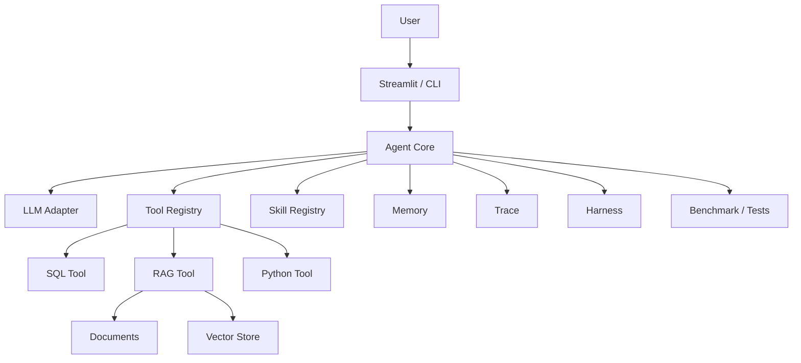

# Agent 学习路径

这份学习路径按“先理解概念，再读源码，再动手改”的顺序组织。建议不要一开始就看所有代码，而是每次只聚焦一个模块。

## 阶段 1：先建立整体认知

目标：知道一个标准 Agent 项目由哪些模块组成。

阅读：

- `README.md`
- `docs/agent_architecture.md`
- `CONTRIBUTING.md`
- `docs/development.md`

要能回答：

- Agent Core、Tools、RAG、Memory、MCP、Eval、Trace 分别负责什么？
- 这个项目为什么不是 LangChain 项目？
- 为什么学习阶段手写 Agent 有价值？

动手任务：

```bash
make doctor
make check
make run-app
```

## 阶段 2：理解 Agent Core / ReAct 循环

源码入口：

- `src/agent/core.py`
- `src/llm/client.py`
- `src/llm/models.py`

重点理解：

- 用户消息如何进入 Agent。
- system prompt 如何构建。
- LLM 如何返回 tool call。
- Agent 如何执行工具并把 observation 回填给 LLM。
- 为什么要限制 `max_iterations`。
- trace 是在什么位置记录的。

要能回答：

- ReAct 中 Reason、Act、Observe 分别对应代码里的哪部分？
- Agent 和 LLM 的边界在哪里？
- 为什么 Agent 不是简单调用一次模型？

练习：

- 找到工具调用循环。
- 给 Agent 增加一个 fake LLM 测试用例。
- 故意让工具报错，观察 trace 如何记录。

## 阶段 3：理解 Tool Calling

源码入口：

- `src/tools/base.py`
- `src/tools/sql_tool.py`
- `src/tools/calculator_tool.py`
- `src/tools/file_tool.py`
- `src/tools/python_tool.py`
- `tests/test_tools.py`

重点理解：

- Tool 的 `name`、`description`、`parameters`、`execute`。
- JSON Schema 如何影响 LLM 选择和传参。
- 工具为什么必须自己做安全校验。
- ToolRegistry 如何统一注册工具。

要能回答：

- Tool 和普通函数有什么区别？
- 为什么 description 写不好会影响工具调用？
- 为什么不能只靠 prompt 防止危险输入？

练习：

- 新增一个 `text_summary` 或 `date_helper` 工具。
- 为它补测试。
- 运行 `make check`。

## 阶段 4：理解 RAG

源码入口：

- `src/rag/loader.py`
- `src/rag/chunker.py`
- `src/rag/embedder.py`
- `src/rag/vector_store.py`
- `src/rag/retriever.py`
- `src/rag/reranker.py`
- `src/rag/rag_tool.py`
- `tests/test_rag.py`

重点理解：

- 文档如何加载。
- chunk 为什么影响检索质量。
- Embedding 为什么有真实模型和 hash fallback。
- 向量检索和 BM25 各自擅长什么。
- manifest 如何解决索引过期问题。
- RAG Tool 如何把检索能力暴露给 Agent。

要能回答：

- RAG 为什么不是“把文档塞进 prompt”？
- 什么情况下 BM25 比向量检索更有用？
- 真实 Embedding 为什么不放进默认 CI？

练习：

- 增加一篇知识库文档。
- 运行 RAG 索引。
- 用 UI 或测试验证新内容能被检索到。

## 阶段 5：理解 Skills

源码入口：

- `src/skills/base.py`
- `src/skills/data_analysis.py`
- `src/skills/sql_expert.py`
- `src/skills/report_gen.py`
- `src/skills/doc_qa.py`
- `tests/test_agent.py`

重点理解：

- Skill 和 Tool 的区别。
- keyword / embedding / hybrid 路由策略。
- Skill 如何影响 system prompt 和工具使用倾向。

要能回答：

- 为什么需要 Skill，而不是只有 Tool？
- Skill 更像“能力策略”还是“执行函数”？
- 语义路由相比关键词路由有什么好处和风险？

练习：

- 新增一个“数据质量检查 Skill”。
- 写关键词和语义描述。
- 补路由测试。

## 阶段 6：理解 Memory

源码入口：

- `src/memory/short_term.py`
- `src/memory/long_term.py`
- `src/memory/episodic.py`
- `src/memory/working.py`
- `tests/test_memory.py`

重点理解：

- 短期记忆：当前对话窗口。
- 长期记忆：跨会话保存重要信息。
- 情景记忆：一次交互的摘要。
- 工作记忆：当前任务步骤和状态。
- 为什么对话太长需要压缩。

要能回答：

- Memory 和 RAG 的区别是什么？
- 为什么不能把所有历史消息都塞进上下文？
- 长期记忆应该保存什么，不应该保存什么？

练习：

- 让 Agent 记住一个偏好。
- 在后续对话中验证是否能召回。

## 阶段 7：理解 MCP

源码入口：

- `src/mcp/client.py`
- `mcp_servers/sqlite_server.py`
- `mcp_servers/knowledge_server.py`

重点理解：

- MCP 为什么是 client/server 模式。
- JSON-RPC stdio 如何通信。
- 外部系统如何标准化成工具。
- MCP Server 为什么必须限制权限。

要能回答：

- MCP 和普通 Tool 有什么关系？
- 为什么 MCP 适合连接外部系统？
- MCP Server 的安全边界在哪里？

练习：

- 新增一个简单 MCP Server 工具，例如返回知识库统计信息。

## 阶段 8：理解 Evaluation / Observability / CI

源码入口：

- `src/eval/benchmark.py`
- `src/eval/metrics.py`
- `src/harness/`
- `data/harness_cases.yaml`
- `src/observability.py`
- `src/doctor.py`
- `Makefile`
- `.github/workflows/ci.yml`

重点理解：

- Agent 为什么需要 benchmark。
- Harness 如何标准化运行 Agent 并收集工具轨迹。
- dry-run 和 live benchmark 的区别。
- trace 如何帮助定位工具调用、成本和延迟问题。
- CI 为什么默认不跑真实模型。

要能回答：

- 为什么 Agent 不能只靠人工试用验证？
- trace、log、metric 有什么区别？
- Harness、Eval、Tests 的边界是什么？
- `make check` 为什么是项目质量门禁？

练习：

- 新增一个 benchmark case。
- 新增一个 harness case。
- 跑 `make harness`。
- 跑 `make benchmark`。
- 在 UI 里观察一次完整 trace。

## 阶段 9：形成自己的理解

最终你应该能画出这张图，并能讲清每条边代表什么：



学习完成标准：

- 能独立讲清 Agent 的执行流程。
- 能新增一个工具并补测试。
- 能解释 RAG 检索链路。
- 能解释为什么测试要 mock embedding。
- 能对比这个项目和 LangChain / LangGraph。
- 能用一个 demo 展示 Agent 的工具调用链路。
